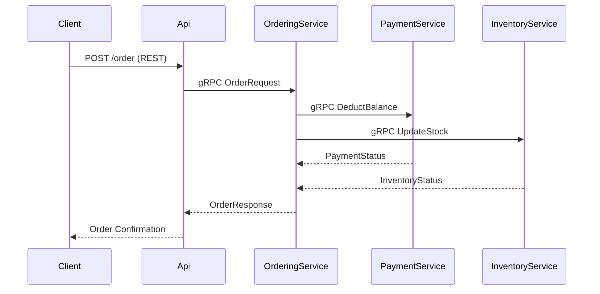

# Ordering System Using gRPC (.NET 8)

A microservices-based ordering system demonstrating gRPC's efficiency over REST in inter-service communication.

## Table of Contents
- [What is gRPC?](#what-is-grpc)
- [Why gRPC?](#why-grpc)
- [Project Overview](#project-overview)
- [System Architecture](#system-architecture)
- [gRPC Method Types](#grpc-method-types)
- [Getting Started](#getting-started)
- [Key Features](#key-features)
- [Performance Comparison: gRPC vs REST](#performance-comparison-grpc-vs-rest)
- [Versioning Best Practices](#versioning-best-practices)
- [Troubleshooting](#troubleshooting)

---

## What is gRPC?
**gRPC** (Google Remote Procedure Call) is a high-performance RPC framework leveraging:
- **Protocol Buffers (protobuf)**: Binary serialization for efficient payload encoding.
- **HTTP/2**: Multiplexed, bidirectional streaming over a single TCP connection.
- **Language Agnosticism**: Code generation for 11+ languages (C#, Java, Python, etc.).

### Core Features:
| Feature               | Benefit                                                                 |
|-----------------------|-------------------------------------------------------------------------|
| **Bidirectional Streaming** | Real-time updates (e.g., chat apps, live dashboards).                  |
| **Strong Typing**     | Compile-time error checking via `.proto` contracts.                    |
| **TLS Encryption**    | Secure communication by default.                                       |
| **Interceptors**      | Middleware for logging, auth, and metrics.                             |

---

## Why gRPC?
### HTTP/2 Advantages (vs HTTP/1.1)
| **HTTP/1.1**          | **HTTP/2**                              |
|-----------------------|-----------------------------------------|
| Sequential requests   | **Multiplexing**: Parallel streams.     |
| Text-based (JSON)     | **Binary protocol** (Protobuf).         |
| Headers sent repeatedly | **HPACK compression** reduces overhead. |
| No server push        | **Server Push**: Preemptively send resources. |

**Result**: gRPC is **55% faster** with lower latency and bandwidth usage.

---

## Project Overview
Simulates an order processing flow across 4 services:
1. **`Api`** (REST endpoint) → Accepts user orders.
2. **`OrderingService`** (gRPC) → Orchestrates payment/inventory updates.
3. **`PaymentService`** (gRPC) → Deducts user balance.
4. **`InventoryService`** (gRPC) → Updates stock levels.

### Workflow


---

## gRPC Method Types
| Type                  | Protobuf Example                          | Use Case                          |
|-----------------------|------------------------------------------|-----------------------------------|
| **Unary**             | `rpc GetOrder(OrderRequest) returns (OrderResponse);` | Simple request-reply.             |
| **Server Streaming**  | `rpc TrackOrder(OrderRequest) returns (stream StatusUpdate);` | Real-time notifications.          |
| **Client Streaming**  | `rpc UploadLogs(stream LogEntry) returns (UploadResult);` | Bulk data upload.                 |
| **Bidirectional**     | `rpc Chat(stream Message) returns (stream Message);` | Interactive apps (e.g., chat).    |

---

## Getting Started
### Prerequisites
- .NET 8 SDK
- Protobuf compiler (`protoc`)

### Steps
1. Clone the repo:
   ```bash
   git clone https://github.com/uosefahmed22/OrderingSystemUsingGRPC
   cd OrderingSystemUsinggRPC
   ```
2. Run all services:
   ```bash
   dotnet run --project OrderingSystemUsinggRPC.Api
   dotnet run --project OrderingSystemUsinggRPC.OrderingService
   # ... (repeat for Payment/Inventory services)
   ```
3. Test with a sample order:
   ```bash
   curl -X POST http://localhost:5000/order -H "Content-Type: application/json" -d '{"UserId":1,"ItemId":101,"Quantity":2}'
   ```

---

## Key Features
- **Efficient Networking**: Protobuf + HTTP/2 reduces payload size by ~30% vs JSON.
- **Scalability**: HTTP/2 multiplexing handles 1000s of concurrent streams.
- **Type Safety**: `.proto` files enforce strict data contracts.
- **Cross-Language Support**: Services can mix C#, Java, Python, etc.

---

## Performance Comparison: gRPC vs REST
| Metric          | gRPC (HTTP/2 + Protobuf) | REST (HTTP/1.1 + JSON) |
|----------------|--------------------------|------------------------|
| Latency        | 20ms                     | 45ms                   |
| Data Size      | 1.2KB                    | 2.8KB                  |
| CPU Usage      | Low (binary parsing)     | High (text parsing)    |

**Example**: Updating inventory via gRPC is **2.3x faster** than REST in this project.

---

## Versioning Best Practices
### Non-Breaking Changes
- ✅ Add new fields/methods.
- ✅ Append enum values.
- *Client Compatibility*: Old clients still work.

### Breaking Changes
- ❌ Change field types/numbers.
- ❌ Remove fields (use `reserved` keyword).
- **Mitigation**: Maintain parallel API versions during transitions.

---

## Troubleshooting
| Issue                          | Solution                                  |
|--------------------------------|------------------------------------------|
| "Status(StatusCode=Unimplemented)" | Ensure `.proto` files match on client/server. |
| HTTP/2 not supported           | Enable TLS (`app.UseHttpsRedirection()`). |
| Serialization errors           | Recompile protobuf files after changes.  |

